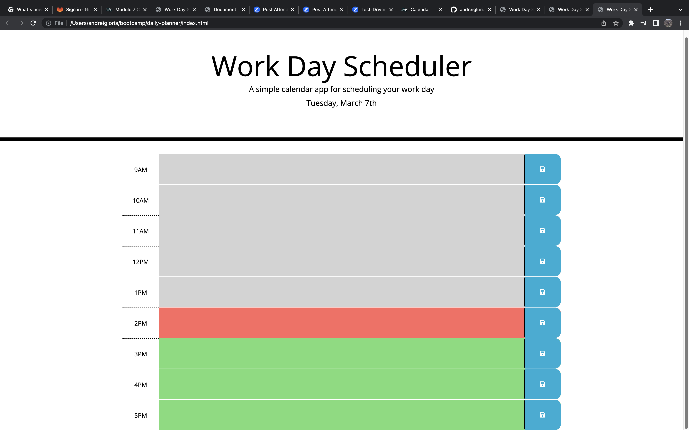

# Daily Planner

## Description 

The focus of this project is to create a Daily Planner App that runs in the browser which features a dynamically updated HTML and CSS powered by JQuery. This enables an employee with a busy schedule to add important events to a daily planner so that they can manage their time effectively.

## Installation

N/A

## Usage

To use the daily planner, users are free to insert their schedule within any timeblocks. They could then save them by clicking the save button at the end of each timeblock to prevent losing their schedule when the website is refreshed. 

## Credits

N/A

## License

GNU General Public License
